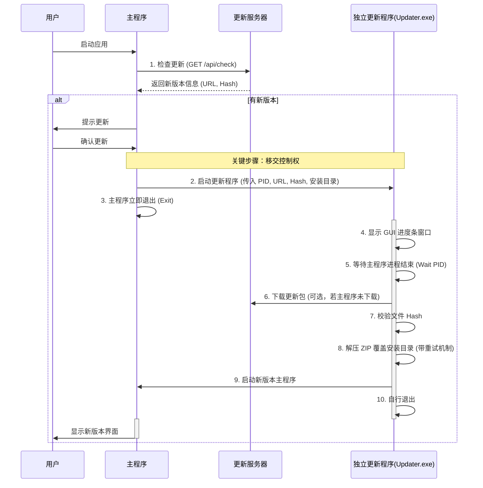

# 通用软件更新功能开发指南

本文档旨在指导不同编程语言开发的软件接入通用的自动更新功能。核心设计思想是采用**独立进程更新（Independent Updater Process）**模式，以解决主程序更新时文件被占用、界面卡死等问题。

---

## 一、 核心架构设计

### 1.1 设计理念
为了确保更新的稳定性和用户体验，更新流程推荐采用以下模式：
1.  **主程序 (Main App)**：负责业务逻辑，以及更新的**检查**。发现更新后，直接拉起更新程序。
2.  **更新程序 (Updater)**：一个独立的可执行文件，负责**下载**（可选）、**显示进度界面**、**等待主程序退出**、**解压覆盖文件**和**重启主程序**。
    *   *注：将下载逻辑迁移至更新程序可以使主程序更早退出，避免主程序在下载期间占用文件或内存，且更新界面更统一。*

### 1.2 流程图


---

## 二、 详细开发步骤

### 2.1 服务端准备
确保 API 接口符合《API 使用指南》规范，并提供 ZIP 格式的更新包。
**注意**：ZIP 包内应直接包含程序文件（如 `截图贴图工具.exe`），不要包含多余的顶层文件夹，以确保解压后路径正确。

### 2.2 客户端开发 - 主程序 (Main App)

**职责**：
1.  **检测更新**：启动时静默检查或由用户手动触发。
2.  **启动 Updater**：使用“分离进程”（Detached Process）方式启动，并立即结束自身进程。

**关键代码逻辑 (伪代码)**：
```javascript
// 1. 获取更新信息
updateInfo = checkUpdate(apiUrl);

// 2. 准备参数
updaterPath = "./updater.exe";
installDir = getCurrentDir();
mainExe = "myapp.exe";
currentPid = getProcessId();

// 3. 启动 Updater
// 推荐传入 --url 让 Updater 处理下载，以获得更好的 UI 体验
spawnProcess(updaterPath, [
    "--url", updateInfo.url,
    "--hash", updateInfo.hash,
    "--dir", installDir,
    "--exe", mainExe,
    "--pid", currentPid
], { detached: true, stdio: 'ignore' });

// 4. 立即退出
exit(0);
```

### 2.3 客户端开发 - 更新程序 (Updater)

**职责**：
建议作为一个带有简单 UI（如进度条）的独立程序，确保在主程序关闭后能完全控制安装目录。

**参数定义**：
- `--url`: 更新包下载地址（推荐由 Updater 下载）
- `--zip`: 本地更新包路径（若主程序已下载）
- `--hash`: 预期的 SHA256 哈希值
- `--dir`: 软件安装目录
- `--exe`: 主程序文件名（用于重启）
- `--pid`: 主程序进程 ID（用于确保其已关闭）

**核心逻辑 (伪代码)**：
```python
function main(args):
    // 1. 等待/清理主程序
    if args.pid:
        wait_for_process_exit(args.pid, timeout=10s)
        if is_running(args.pid): force_kill(args.pid)

    // 2. 下载与校验 (推荐在 Updater 中完成)
    if args.url:
        download_with_progress(args.url, temp_zip_path)
        verify_hash(temp_zip_path, args.hash)

    // 3. 执行覆盖 (核心：重试机制)
    for i in 1..5:
        try:
            extract_zip(args.zip, args.dir, skip="updater.exe")
            success = true; break
        catch error:
            sleep(2000) // 等待文件句柄释放
    
    // 4. 重启与清理
    if success:
        launch(join(args.dir, args.exe))
        cleanup(temp_zip_path)
```

---

## 三、 多语言实现指南

### 3.1 Python 实现 (参考)
请参考配套提供的 `updater.py` 源码。
**关键点**：
- 使用 `subprocess.Popen` 启动主程序。
- 使用 `ctypes` 或 `psutil` 检查和杀死进程。
- 使用 `zipfile` 模块解压。

### 3.2 C# / .NET 实现
**启动 Updater**:
```csharp
ProcessStartInfo startInfo = new ProcessStartInfo("updater.exe");
startInfo.Arguments = $"--zip \"{zipPath}\" --dir \"{appDir}\" --exe \"{exeName}\" --pid {Process.GetCurrentProcess().Id}";
startInfo.UseShellExecute = true; // 关键：独立 shell 执行
Process.Start(startInfo);
Environment.Exit(0);
```

**Updater 逻辑**:
```csharp
// 等待进程
try {
    Process p = Process.GetProcessById(pid);
    p.WaitForExit(5000);
    if (!p.HasExited) p.Kill();
} catch {}

// 解压
ZipFile.ExtractToDirectory(zipPath, targetDir, true); // true = overwrite
```

### 3.3 C++ / Qt 实现
**启动 Updater**:
```cpp
QStringList args;
args << "--zip" << zipPath << "--dir" << appDir << "--exe" << exeName << "--pid" << QString::number(QCoreApplication::applicationPid());
QProcess::startDetached("updater.exe", args); // 关键：startDetached
QCoreApplication::quit();
```

### 3.4 Node.js / Electron 实现
**启动 Updater**:
```javascript
const { spawn } = require('child_process');
const subprocess = spawn('updater.exe', [
  '--zip', zipPath,
  '--dir', appDir,
  '--exe', exeName,
  '--pid', process.pid
], {
  detached: true, // 关键
  stdio: 'ignore'
});
subprocess.unref(); // 允许父进程退出
app.quit();
```

---

## 四、 常见问题 (FAQ)

### Q1: Updater.exe 自身如何更新？
**答**：通常 Updater.exe 逻辑简单，极少需要更新。如果确实需要更新，可以采用“双 Updater”策略（Updater v1 更新 Updater v2），或者在主程序启动时检查并替换 Updater.exe。

### Q2: 权限不足怎么办？
**答**：如果安装目录在 `C:\Program Files` 等受保护目录，Updater 需要管理员权限。
